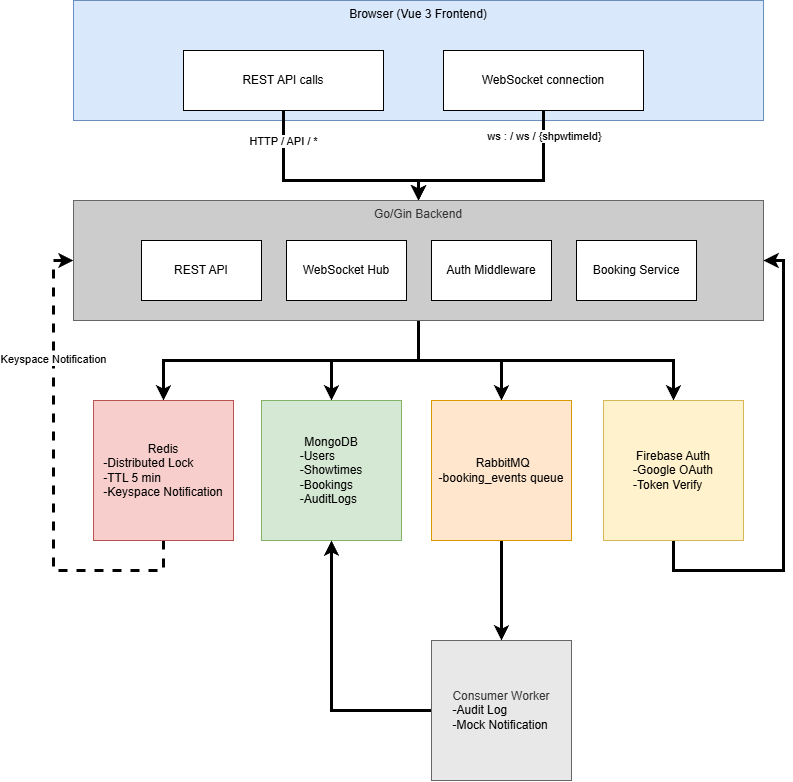
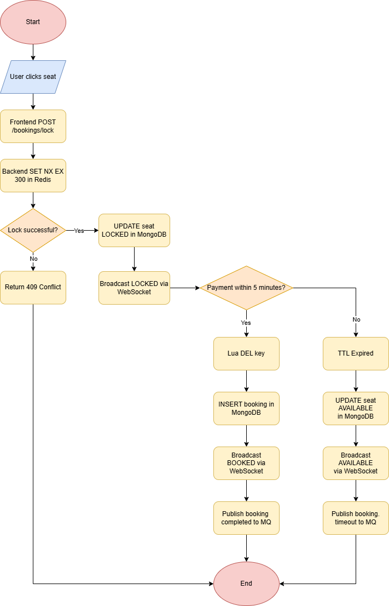

# 🎬 Cinema Ticket Booking System

A real-time cinema seat booking system built with Go, Vue 3, MongoDB, Redis, and RabbitMQ.
Supports concurrent seat locking with zero double-booking guarantee.

---

## 1. System Architecture



---

## 2. Tech Stack

| Layer | Technology | Reason |
|---|---|---|
| Backend | Go 1.22 + Gin | Fast, low memory, great concurrency primitives |
| Frontend | Vue 3 + Vite + Pinia | Reactive, composable, lightweight |
| Database | MongoDB 7 | Flexible seat schema, easy embed seats in showtime doc |
| Cache / Lock | Redis 7 | Atomic SETNX for distributed lock; keyspace notifications for TTL |
| Realtime | WebSocket (gorilla/websocket) | Push seat state changes instantly to all clients |
| Message Queue | RabbitMQ 3 | Durable async event bus for audit logging and notifications |
| Auth | Firebase Auth (Google OAuth) | Handles OAuth complexity, token verification is stateless |
| Deployment | Docker + docker-compose | Single command startup |

---

## 3. Booking Flow (Step by Step)



---

## 4. Redis Lock Strategy

### Why Redis Distributed Lock?

When multiple users click the same seat simultaneously, we need exactly one winner.
A database-level check-then-update is not atomic and leads to race conditions.
Redis `SET key value NX EX` is a single atomic command — no race possible.

### Implementation

```
SET seat_lock:{showtime_id}:{seat_id} {user_id} NX EX 300
```

| Property | Value | Reason |
|---|---|---|
| Command | `SET NX EX` | Atomic: set only if not exists + expiry in one command |
| Key | `seat_lock:{showtime}:{seat}` | Scoped per showtime+seat pair |
| Value | `user_id` | Lets us verify ownership before unlock |
| TTL | 300 seconds (5 min) | Auto-release if payment not completed |

### Safe Unlock with Lua Script

Plain `DEL` after `GET` is not atomic — another process could acquire the lock between GET and DEL.
We use a Lua script which Redis executes atomically:

```lua
if redis.call("GET", KEYS[1]) == ARGV[1] then
    return redis.call("DEL", KEYS[1])
else
    return 0
end
```

This guarantees: only the user who owns the lock can release it.

### Expired Lock Detection

Redis keyspace notifications (`notify-keyspace-events KEx`) publish to:
`__keyevent@0__:expired`

The backend subscribes to this channel. When `seat_lock:*` keys expire, the backend:
1. Updates seat status back to `AVAILABLE` in MongoDB
2. Broadcasts the change via WebSocket
3. Publishes `booking.timeout` event to RabbitMQ

### Concurrency Guarantee

> 1000 users click the same seat simultaneously →
> Redis processes SET NX commands sequentially →
> Exactly 1 succeeds →
> 999 receive 409 Conflict →
> Zero double bookings.

---

## 5. Message Queue (RabbitMQ)

Queue name: `booking_events` (durable, persistent delivery)

| Event | Trigger | Consumer Action |
|---|---|---|
| `booking.completed` | Payment confirmed | Write AuditLog to MongoDB + mock notification log |
| `booking.timeout` | Redis TTL expired | Write AuditLog to MongoDB + log user notification |
| `seat.released` | Manual release (future) | Write AuditLog to MongoDB |

Why RabbitMQ over Redis Pub-Sub:
- **Durable**: messages survive broker restart
- **Persistent delivery**: `DeliveryMode: Persistent` survives RabbitMQ restart
- **ACK/NACK**: consumer confirms processing; failed events are requeued
- **Management UI**: http://localhost:15672 for visibility

---

## 6. Running the System

### Prerequisites
- Docker Desktop installed and running
- A Firebase project with Google OAuth enabled

### Setup

```bash
# 1. Clone the repo
git clone <repo-url>
cd cinema-booking

# 2. Copy env files
cp .env.example .env
cp frontend/.env.example frontend/.env

# 3. Fill in your Firebase credentials in .env and frontend/.env

# 4. Start everything
docker compose up --build
```

### URLs

| Service | URL |
|---|---|
| Frontend | http://localhost:3000 |
| Backend API | http://localhost:8080 |
| RabbitMQ Management | http://localhost:15672 (admin/secret) |
| MongoDB | mongodb://localhost:27017 |

### Firebase Setup

1. Go to [Firebase Console](https://console.firebase.google.com)
2. Create a project → Enable Google Sign-In under Authentication
3. Generate a service account key (Project Settings → Service Accounts → Generate new private key)
4. Put the JSON content as `FIREBASE_CREDENTIALS_JSON` in `.env`
5. Add your Firebase web config values to `frontend/.env`

### Make yourself admin

```bash
# Connect to MongoDB and update your user role
docker exec -it cinema_mongo mongosh -u admin -p secret --authenticationDatabase admin cinema

db.users.updateOne(
  { email: "your@email.com" },
  { $set: { role: "admin" } }
)
```

---

## 7. Assumptions & Trade-offs

| Decision | Trade-off |
|---|---|
| Seats embedded in Showtime document | Fast reads for seat map; updating a single seat requires `$` positional operator. Acceptable for cinema scale (≤200 seats per showtime). |
| Redis keyspace notifications for lock expiry | Requires `notify-keyspace-events KEx` on Redis. At-least-once delivery; duplicates are benign (seat already AVAILABLE). |
| Single RabbitMQ queue for all events | Simple for this scale. Production would use separate queues per event type for independent scaling. |
| Mock payment (no real gateway) | Out of scope per requirements. The `confirm` endpoint represents payment success. |
| WebSocket without auth | Seat state is public info (AVAILABLE/LOCKED/BOOKED). No sensitive data sent over WS. Booking actions still require JWT on REST endpoints. |
| No Redis Cluster | Single-node Redis is sufficient. For true HA, use Redis Cluster or Sentinel — lock logic stays the same. |
| Firebase for Auth | Eliminates OAuth implementation complexity. Trade-off is vendor dependency. |

---

## 8. CI/CD

GitHub Actions automatically runs unit tests on every push to main branch.

- **Test framework**: Go testing package
- **Coverage**: Distributed lock logic — seat locking, Lua atomic unlock, wrong owner rejection
- **Trigger**: Push to main / Pull Request
